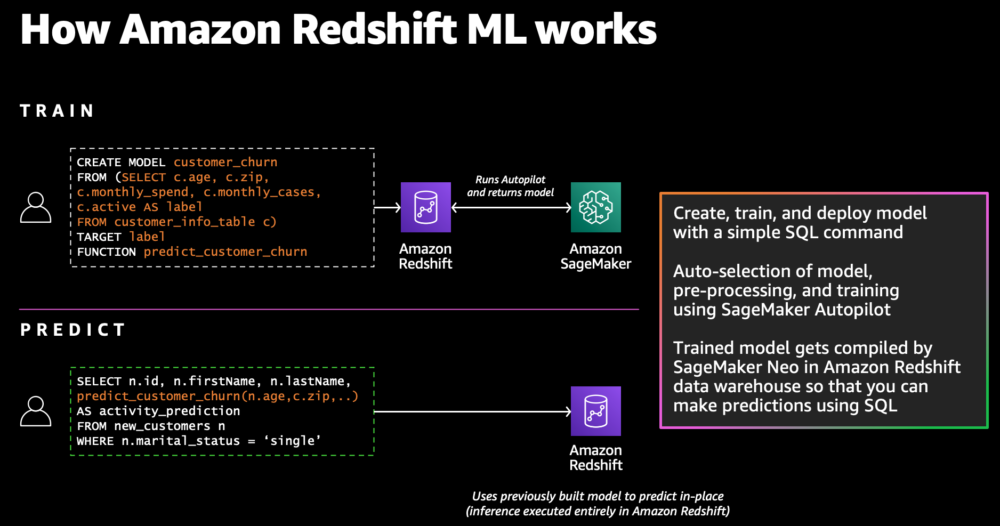

# Getting Started with Redshift ML

In this repo, we’ll showcase some popular use-cases using [Amazon Redshift ML](https://aws.amazon.com/redshift/features/redshift-ml/) and how to get started with it.

## Introduction

Amazon Redshift ML makes it easy for data analysts and database developers to create, train, and apply machine learning models using familiar SQL commands in Amazon Redshift data warehouses. With Redshift ML, you can take advantage of Amazon SageMaker, a fully managed machine learning service, without learning new tools or languages. Simply use SQL statements to create and train Amazon SageMaker machine learning models using your Redshift data and then use these models to make predictions.

## Repository Overview

In this repository, we have three use-cases to demonstrate on how to implement [Binary Classification](./use-cases/binary-classification), [Multi-Class Classification](./use-cases/multiclass-classification) and [Regression](./use-cases/regression) models using [Amazon Redshift ML](https://aws.amazon.com/redshift/features/redshift-ml/)

We have also provided a [Cloudformation Template](./cloud-formation/cloud-formation-template.yaml) which will setup required configurations for your Amazon Redshift cluster.

## How Redshift ML Works

To use Redshift ML, you use simple SQL query to specify the data in Amazon Redshift you want to use as the data inputs to train your model and the output you want to predict. For example, to create a model that predicts customer churn, you can query columns in one or more tables in Amazon Redshift that include the customer profile information and historical account activity as the inputs, and the column showing whether the customer is active or inactive as the output you want to predict.

## Security

See [CONTRIBUTING](CONTRIBUTING.md#security-issue-notifications) for more information.

## License

This library is licensed under the MIT-0 License. See the LICENSE file.

