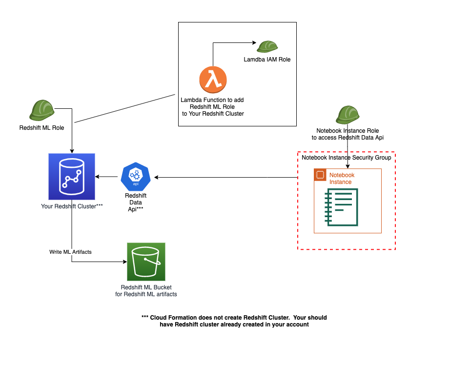
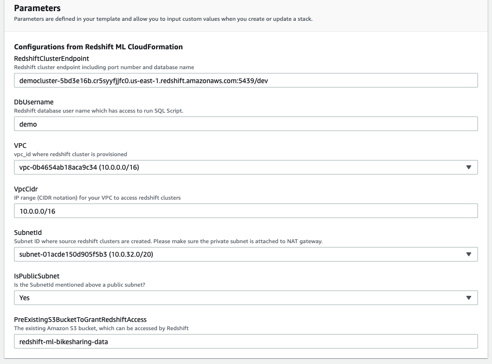

## AWS CloudFormation Template to get started with Amazon Redshift ML

This repository includes a [CloudFormation template](cloud-formation-template.yaml), which will create resources needed to use Redshift ML features on your already existing Redshift Cluster.  This section details the setup and use of the template.

This is a visual architecture of the CloudFormation installer:

The intent of this template is to simplify the setup work necessary to create Notebook Instance, S3 Bucket and configure Security between among Your Redshift Cluster and other resources created by this template.

## Prerequisites

* Make sure you already have a Redshift Cluster running in your account.
* Also, a user will be required with the necessary privileges to run the template.
* The template requires several input parameters, below picture displays them

**Note about Pre Existing S3 Bucket:**
This is the parameter,  where your source data is located.  Provider Bucket name and this template will setup necessary permissions so it is accessed.

## Usage Steps

Create a CloudFormation stack with template that you require, You can also use the table of links below. This stack will include everything needed to set up your account so use cases posted in this repository are run.

**Please Note:**

1. This stack will be created in the same region where you invoke the template.  
2. The input parameters are not cross-checked at template creation time, so make sure that the subnet choice matches the availability zone you require.

## Launch Cloud Formation Template

