## Producer Simulator
In this section you will walk through a step-by-step process to generate transaction data by using a custom built simulator.  The simulated dataset will highlight most of the issues that practitioners of fraud detection face using real-world data. In particular, they will include class imbalance (less than 1% of fraudulent transactions), a mix of numerical and categorical features (with categorical features involving a very large number of values).  Following sections will talk about the data set in detail.  In this section you will first learn how to generate the sample dataset for our walk through.  You can learn more about this data set here. 

### Simulator

1.	Connect to the EC2 instance created in the prerequisite.

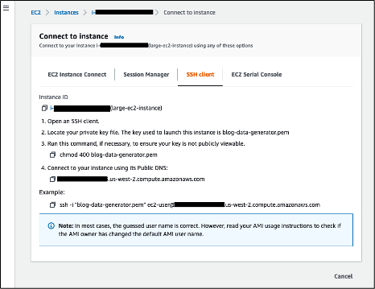

You should see below screen after a successful connection

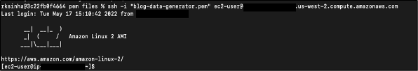
	 	
2.	Configure AWS CLI on EC2 instance

Capture the AWS Access Key and the secret access key. You can read about configuration here. 
On the console type “aws configure” and enter the appropriate values as shown below, enter to exit. 

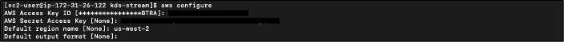
 
3.	Create folder structures.

 under /home/ec2-user/ director run below commands <br>

This is the main folder which holds all the data files and the code required to generate and push data to KDS.
```
mkdir /home/ec2-user/kds-stream
```

This folder is used to hold the generated transaction data and work as a source for Kinesis Data Streams.
```
	mkdir /home/ec2-user/kds-stream/source
```
This folder is used to hold the processed transactions data which has already been pushed to Kinesis Data Streams.
```
	mkdir /home/ec2-user/kds-stream/source_archive
```

After creating the above folders, the tree structure will look like below.
 
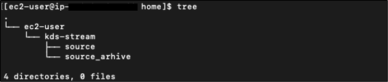

4.	Generate the Data

* 4.1
	Navigate to /home/ec2-user/kds-stream and download generated-transactions-data.py from the Git.

In my case I am using git clone command to download the code. If you have it configured you can run Git clone command similar to below if not please manually download the and upload the  [generate-transaction-data.py](code/generate-transaction-data.py) to /home/ec2-user/kds-stream/ directory. 

```
git clone https://gitlab.aws.dev/bhanuaws/amazon-redshift-streaming-getting-started.git 
```

Now run the tree command to view files to make sure file is in the folder. 

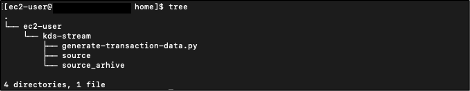

* 4.2.	Next step is to run the python program to generate the transactions and write them to files under the source folder. 
```
	python3 /home/ec2-user/kds-stream/generated-transactions-data.py
```
Once the above program runs successfully, you should be able to see the generated files in /home/ec2-user/kds-stream/source folder. 

Here is the screenshot from my terminal.

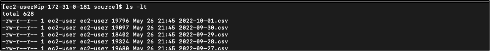
 


This program dynamically takes today’s date as an input for the transaction date and generates 100K transactions for one day. Generation of this data takes approximately around 10 mins.  Once the process is complete you would see one csv file containing our synthetic data records


### Publish data to KDS

In this section you walk through building a producer to write transactions to Amazon Kinesis Data Streams.  For this blog post we are using boto3 put record method to write data to Kinesis stream
To publish data into the kinesis stream, you must specify the name of the stream, a partition key, and the data blob to be added to the stream. The partition key is used to determine which shard in the stream the data record is added to. You can learn more about kinesis streams here. 
In this section a custom-built process will pick up a file from the source folder and then write the content to kinesis stream and finally the same code will move that file to the archive folder, follow below steps to complete this process. 

1.	Download the [push-transaction-data-to-kds-stream.py](code/push-transaction-data-to-kds-stream.py) from Git and copy under the /home/ec2-user/kds-stream/.  This python file has necessary code already written for you to publish data to Kinesis stream which was created in the Setup Kinesis Data Stream section. 

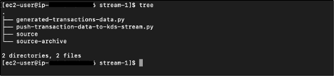
 

2.	You need to open the file and update values for below parameters. You can use vi editor or your favorite choice of editor to edit the file. 

Source_folder_name: This folder holds the generated transactions and, in my case, it is /home/ec2-user/kds-stream/source

Archive_folder_name: This folder holds the processed transactions which is sent to Kinesis data stream and in my case, it is /home/ec2-user/kds-stream/source-archive

Stream_name:  This is the name of Kinesis data stream created in the first step and in my case, it is cust-payment-txn-stream

Region_name: Get this from AWS Console where Kinesis stream was created. In my case it is ‘us-west-2’

Below screenshot shows what my setup is looking like. 

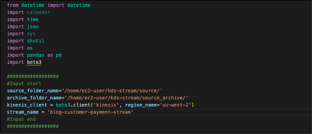

The python program uses the boto3 library to publish the generated data to KDS. It uses put_records api call to publish 500 records in batches.

1.	Execute the python program to publish the transaction data to Kinesis data stream as below,
```
python3 push-transaction-data-to-kds-stream.py
```
2.	Monitor the progress

* 2.1	Verify the source folder has data files, these file(s) get created in step 1. When the producer process is run these file(s) will be moved slowly to the source_archive folder. Once the KDS process is run successfully, the source folder will be empty.

 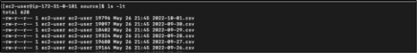


* 2.2.	Verify the source_archive folder to see the published files.  Below screenshot shows that my process has published files to the archive folder. 

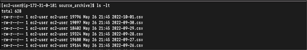

* 2.3.	Verify the Kinesis console to monitor the data sent to KDS

One of the metrics “incoming data – sum(count)” can be used for tracking. This metric tracks the total number of records sent in a PutRecords operation per Kinesis data stream, measured over the specified time period.  In my case I see that my process has pushed 137,000 records.   This shows that our producer process is working without any errors. 

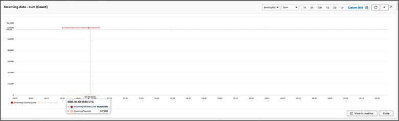

